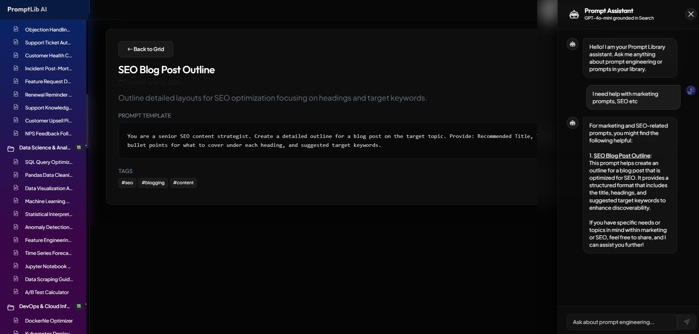
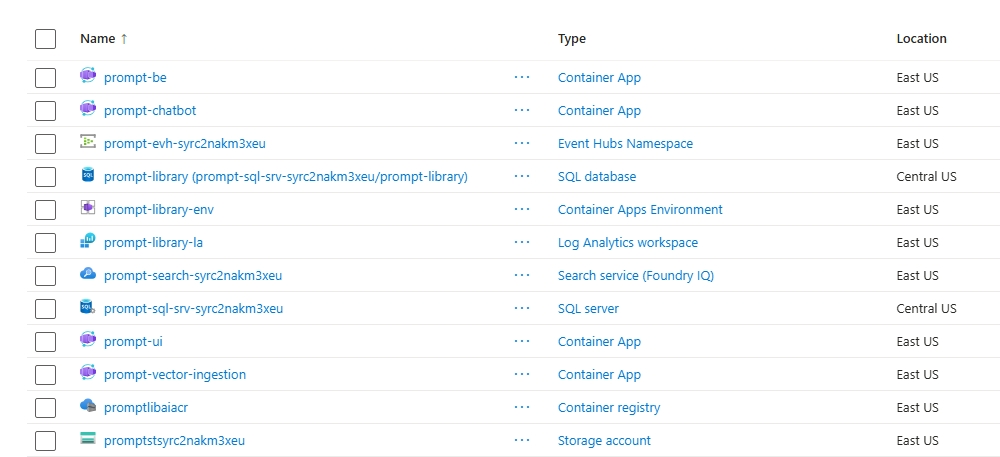
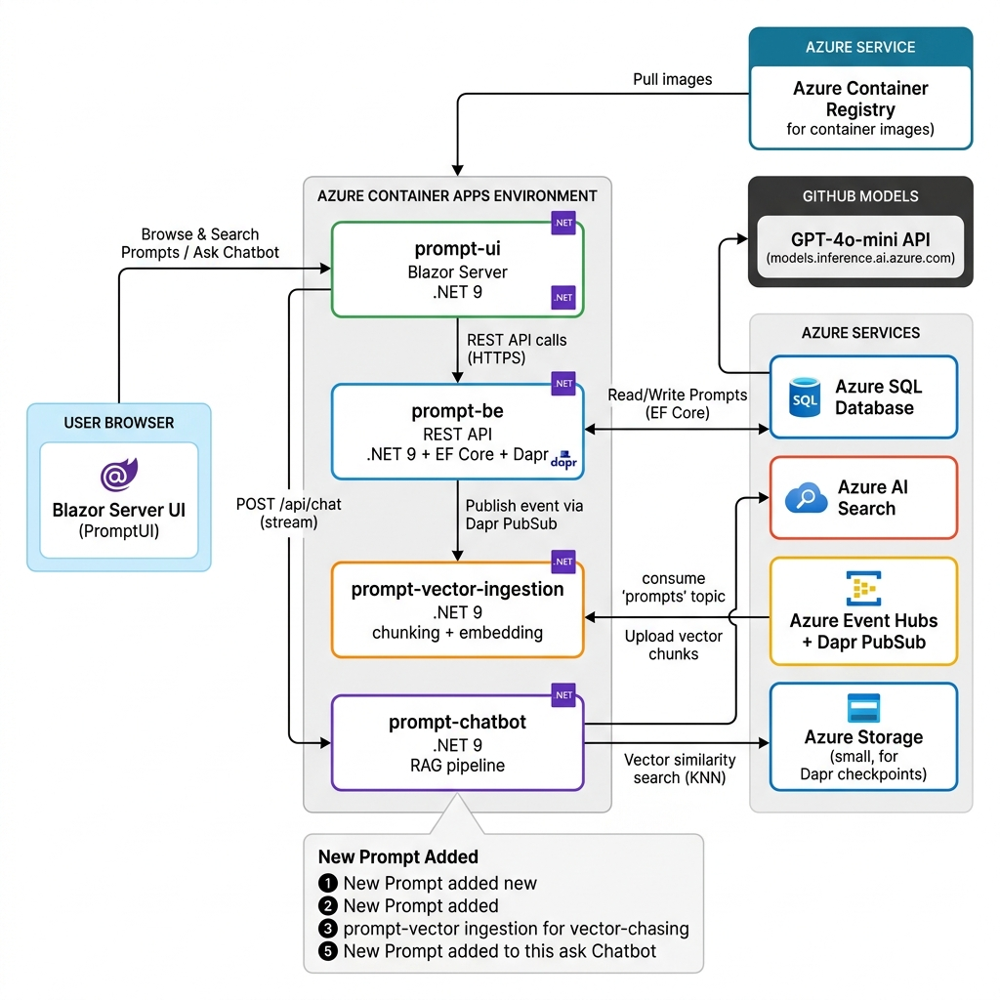

# 📚 Prompt Library AI

A full-stack **AI-powered Prompt Library** that demonstrates a production-quality **Retrieval-Augmented Generation (RAG)** pipeline on Azure. Users can browse, search, and manage a curated collection of LLM prompt templates. An intelligent chatbot — backed by Azure AI Search and GPT-4o-mini — lets users converse with the library to discover, refine, and understand prompts using natural language.

## 🖥️ Application Demo



## ☁️ Azure Components



---

## 🗺️ Architecture Overview



The system is composed of **four microservices** deployed as containers in a shared **Azure Container Apps** environment, connected by event-driven messaging via **Dapr** and **Azure Event Hubs**, and backed by **Azure SQL**, **Azure AI Search**, and the **GitHub Models GPT-4o-mini** inference endpoint.

---

## 🧩 Technical Stack

| Layer | Technology |
|---|---|
| **Frontend** | Blazor Server (.NET 9), Bootstrap 5, Vanilla CSS |
| **Backend API** | ASP.NET Core Minimal API (.NET 9), Entity Framework Core |
| **Event Messaging** | Dapr PubSub (Azure Event Hubs transport) |
| **Vector Ingestion** | ASP.NET Core Minimal API (.NET 9), Azure AI Search SDK |
| **Chatbot / RAG** | ASP.NET Core Minimal API (.NET 9), Azure AI Search SDK, OpenAI SDK |
| **LLM** | GPT-4o-mini via GitHub Models (`models.inference.ai.azure.com`) |
| **Database** | Azure SQL Database (EF Core Code-First, auto-migrations on startup) |
| **Vector Store** | Azure AI Search (HNSW index, cosine similarity, 1536-dimension vectors) |
| **Containers** | Docker / Azure Container Registry (.NET SDK `PublishContainer`) |
| **Infrastructure** | Azure Bicep (IaC), deployed via `release-azure.sh` |
| **Observability** | OpenTelemetry (tracing + logging) → Azure Log Analytics |

---

## ☁️ Azure Components Provisioned

The [`prompt-library-ai.bicep`](prompt-library-ai.bicep) file provisions the following resources in a single resource group:

| Azure Resource | Name Pattern | Purpose |
|---|---|---|
| **Azure Container Registry** | `promptlibaiacr` | Stores all four container images |
| **Azure Container Apps Environment** | `prompt-library-env` | Shared managed hosting environment for all microservices |
| **Container App: prompt-ui** | `prompt-ui` | Blazor Server frontend (public ingress) |
| **Container App: prompt-be** | `prompt-be` | REST API + Dapr-enabled event publisher (public ingress) |
| **Container App: prompt-vector-ingestion** | `prompt-vector-ingestion` | Async vector indexing worker (internal only) |
| **Container App: prompt-chatbot** | `prompt-chatbot` | RAG chatbot API (internal only) |
| **Azure SQL Server + Database** | `prompt-sql-srv-*` / `prompt-library` | Relational store for prompts, categories, tags |
| **Azure Event Hubs Namespace** | `prompt-evh-*` | Standard-tier namespace for async event streaming |
| **Event Hub Topic** | `prompts` | Topic for new-prompt-added events |
| **Event Hub Consumer Group** | `prompt-vector-ingestion` | Dedicated consumer group for the ingestion service |
| **Azure Storage Account** | `promptst*` | Blob container for Dapr checkpoint state |
| **Dapr PubSub Component** | `pubsub` | Wires Event Hubs into the Dapr pub/sub API |
| **Azure AI Search** | `prompt-search-*` | Free-tier HNSW vector index (`prompts-index`) |
| **Log Analytics Workspace** | `prompt-library-la` | Centralized logging sink for all container apps |

> **LLM Note**: GPT-4o-mini is called via the GitHub Models inference endpoint (`models.inference.ai.azure.com`) using a Personal Access Token stored as a Container App secret. 

---

## 🔄 Data Flow: Adding a New Prompt

When a user submits a new prompt through the UI, the following sequence occurs:

```
User (Browser)
   │
   │  1. POST /api/prompts  (title, description, promptText, category, tags)
   ▼
prompt-be  (ASP.NET Core API)
   │  ├─ Validates input
   │  ├─ Persists Prompt, Category, Tags to Azure SQL via EF Core
   │  └─ 2. Publishes Dapr event → pubsub / "prompts" topic
   │                  │
   │         Azure Event Hubs
   │                  │
   ▼                  ▼
prompt-vector-ingestion  (subscribes to "prompts" topic via Dapr)
   │  ├─ 3. Receives PromptEventPayload (id, title, category, tags, description, promptText)
   │  ├─ Builds weighted embedding text:
   │  │     Title (×3) → Category (×2) → Tags (×2) → Description → PromptText
   │  ├─ Splits text into 500-char chunks
   │  ├─ 4. Generates embedding vector for each chunk (1536-dim)
   │  └─ 5. Uploads PromptSearchDocument(s) to Azure AI Search index
   │
   ▼
Azure AI Search  ("prompts-index")
   └─ Vector chunks now available for similarity search
```

### Step-by-step breakdown

1. **Save to SQL** — `PromptBE` writes the prompt to Azure SQL Database, creating or reusing the Category and Tag entities via EF Core.
2. **Publish event** — `PromptBE` uses the Dapr client to publish a JSON payload to the `pubsub` Dapr component, targeting the `prompts` topic. Dapr routes this through Azure Event Hubs.
3. **Receive event** — `PromptVectorIngestion` has a Dapr topic subscription on `POST /api/ingest-prompt`. It receives the payload asynchronously.
4. **Chunk & embed** — The service builds a weighted text representation (title and category/tags are repeated to give them higher semantic weight) and splits it into 500-character chunks. A 1536-dimension embedding vector is generated for each chunk.
5. **Index** — Each chunk becomes a `PromptSearchDocument` uploaded to the Azure AI Search `prompts-index` HNSW index. Old chunks for the same `promptId` are deleted first to prevent orphans.

---

## 💬 RAG Chatbot: Query Flow

When a user types a question in the chatbot:

```
User query  →  prompt-chatbot
                  │
                  ├─ 1. Generate embedding vector for the user query (1536-dim)
                  ├─ 2. KNN vector search against Azure AI Search (top 3 chunks)
                  ├─ 3. Build grounded system prompt (grounding.txt + retrieved chunks)
                  ├─ 4. POST to GitHub Models GPT-4o-mini  (/chat/completions)
                  └─ 5. Stream response back to PromptUI  →  User
```

Retrieved chunks include the prompt title and a relative URL (`/prompt/{id}`) so the LLM can include **clickable links** to specific prompts in its response.

---

## 🏗️ Microservice Descriptions

### [`PromptUI`](PromptUI/) — Blazor Server Frontend
- Renders the prompt library explorer with category tree navigation, tag filters, and full-text search.
- Hosts the **AI chatbot drawer** — a slide-in panel that streams responses token-by-token.
- Updates the browser URL with `?prompt={id}` when a prompt is selected for deep-linking.
- Communicates with `prompt-be` (REST) and `prompt-chatbot` (streaming HTTP) via internal Container Apps networking.

### [`PromptBE`](PromptBE/) — REST API + Event Publisher
- Minimal API with EF Core: `GET /api/prompts`, `POST /api/prompts`, `GET /api/prompts/{id}`.
- On POST, publishes a Dapr pub/sub event to trigger async vector ingestion.
- Also exposes `POST /api/prompts/sync` for bulk re-indexing of all existing prompts.
- Uses a retry loop (6 attempts, 5s gap) to handle cold-start delays in Azure SQL connectivity.

### [`PromptVectorIngestion`](PromptVectorIngestion/) — Async Indexing Worker
- Subscribes to Dapr `prompts` topic via `POST /api/ingest-prompt`.
- Exposes `POST /api/bulk-ingest` for batch re-indexing and `POST /api/reset-index` to recreate the search index.
- Generates weighted embedding text: **Title × 3, Category × 2, Tags × 2**, then body text — ensuring key metadata dominates the vector space.
- Deletes stale chunks for a prompt before re-uploading to keep the index clean.

### [`PromptChatbot`](PromptChatbot/) — RAG API
- Exposes `POST /api/chat` with streaming response (`text/plain`).
- Implements the full RAG loop: embed query → vector search → build grounded prompt → call LLM → stream tokens.
- Grounding instructions are loaded from [`grounding.txt`](PromptChatbot/grounding.txt) at runtime, allowing behaviour to be updated without a redeploy.
- Falls back to a simulated streaming response if the LLM endpoint is not configured.

---

## 🚀 Deployment

### Local Development
```bash
./run-local.sh   # Runs all 4 services via Docker Compose
```

### Azure Release
```bash
./release-azure.sh  # Builds containers, pushes to ACR, deploys via Bicep
```

The release script:
1. Resolves or generates SQL credentials securely
2. Loads the GitHub Models PAT from `.github_models_pat`
3. Detects code changes since the last build (skips rebuild if unchanged)
4. Publishes containers via `dotnet publish -t:PublishContainer`
5. Tags and pushes images to ACR with a timestamp version tag
6. Deploys the Bicep template with the new version tag

---

## 📁 Repository Structure

```
prompt-library-ai/
├── PromptBE/                   # REST API + EF Core + Dapr publisher
├── PromptUI/                   # Blazor Server frontend
├── PromptVectorIngestion/      # Async vector indexing worker
├── PromptChatbot/              # RAG chatbot API (streaming)
├── prompt-library-ai.bicep     # Azure infrastructure as code
├── release-azure.sh            # CI/CD release script
├── run-local.sh                # Local Docker Compose runner
└── prompt-library-ai.sln       # .NET solution file
```
